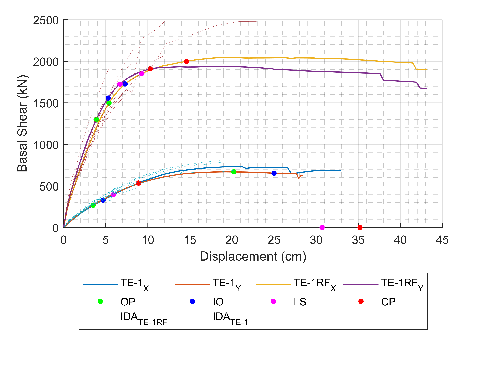

**JUAN PATRICIO CHICAIZA FUENTES**

[LINKEDIN](www.linkedin.com/in/patricio-chicaiza-fuentes)

Ingeniero Civil - Master en Ingeniería Estructural graduado en la Universidad de las Fuerzas Armadas – ESPE, con experiencia en el sector de la infraestructura civil y diseño de edificaciones, conocimientos de ingeniería con aptitudes investigativas y ética de trabajo, habilidad en el uso software especializado dentro de diferentes áreas (administrativo, estructural, vial, entre otros), con experiencia en la elaboración de presupuestos, cronogramas, planillas, diseño, residencia y supervisión de obra. Docente en centros de capacitación especializados en ingeniería y universidades.

# FORMACIÓN ACADÉMICA

| NIVEL       | INSTITUCIÓN          | AÑO|
|:-------------|:------------------|:------|
| Educación Media | Colegio Militar #10 “Abdón Calderón | 2005  |
| Educación Superior| Universidad de las Fuerzas  Armadas–ESPE.Ingeniero Civil    | 2016 |
| Posgrado | Master en Investigación en Ingeniería Civil Mención Estructuras| 2023   |
| Certificaciones | CORFOPYM - PREVENCIÓN EN RIESGOS LABORALES,SETEC-3103-CCL-173980. 2019 | 2019  |


## EXPERIENCIA

|CARGO       | INSTITUCIÓN          | AÑO |
|:-------------|:------------------|:------|
| Investigador/Laboratorista| Universidad de las Fuerzas Armadas – ESPE | 2016  |
| Analista Técnico  | SEDEMI SCC   | 2017  |
| Analista de estructuras y presupuestos| SEDEMI SCC      | 2019   |
| Especialista de cálculo estructural| SEDEMI SCC | 2022  |

### PROYECTOS ESTRUCTURALES

Modelos estructurales avanzados utilizando SEISMOSTRUCT


#### ESPECTRO DE RESPUESTA

Escalamiento sísmico basado en el espectro de la NEC-15.


Relación al espectro objetivo mediante la media artimética de los 11 pares de resgistros


##### PUSHOVER vs. CURVAS IDA

Validación de la respuesta estructural mediante el IDA.



## ANÁLISIS DE PÉRDIDAS

Las curvas de fragilidad obedecen a una función de distribución logarítmica normal mostrada en la ecuación (1), además, la metodología del FEMA-P-58 ofrece sus propias formulaciones para calcular los parámetros estadísticos de mediana y desviación estándar

 

Formualción matemática para aplicación de la metodología FEMA


## COSTOS DE REPARACIÓN

Curvas de fragilidad RSN-864.Curva de fragilidad por deriva global.

 

 
```
The final element.
```
